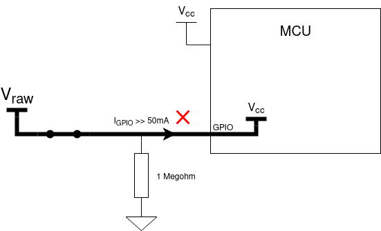
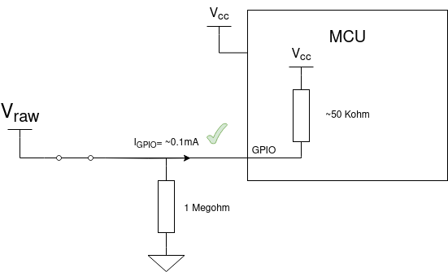
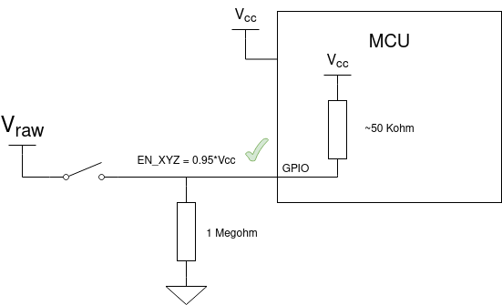

# Psat PSU PCB v1
The PSU PCB provides 1.8V, 3.3V, 5V rails and a raw battery voltage rail. The various supply rails can be enabled, or controlled by software (see Functionality). USB-C and micro-USB connectors are present to charge the battery using a standard USB wall charger.
## Functionality
### Controlling the Supply Rails
The PSU board offers two different control modes for each supply rail, controlled by the switches on the S1 component: 
In the “ON” mode the relevant supply is always on. This is the simplest operating mode and no interaction with the enable pins are necessary. The enable pin is shorted to Vraw in this mode.

In the “OFF / SW control” mode, the supply defaults to off (pulled down by a 1Megohm resistor) but a microcontroller can enable the supply by pulling the enable pin high. If you want to programmatically enable a supply during operation you need to use this mode and connect your microcontroller to the enable pins on the header. See ‘Connections’ for the exact voltage(s) required to enable each supply.

**NOTE**: *If you have connected a microcontroller to the EN pins and plan to use it to control the supplies then a misconfigured S1 switch could result in your microcontroller trying to fight against an enable pin shorted to Vraw. Instead of using your GPIO as an output pin, we suggest setting it as an input pin and toggling the state of the internal pullup resistor to control the supplies. When the internal pullup is enabled it will form a voltage divider with the 1 Megohm external resistor, but it should be more than enough to activate the supply. In the case that S1 is misconfigured (i.e. in the “ON” mode, shorting the enable pin to Vraw) the pullup resistor will limit current to safe levels. See below.*

A misconfiguration when controlling via an output pin can cause a short.

Using an input pin with a pullup resistor enabled will limit current to a safe value even when misconfigured…

…while still allowing control when correctly configured.

### USB charging
The two USB connectors (USB-C and micro-USB) are provided for convenience. **DO NOT PLUG IN TWO CABLES AT ONCE**.
The battery will charge at a rate of 800mA. This rate can be decreased by changing the value of R6, according to the datasheet of the battery charger.

### Disable while charging
The final S1 switch (labelled '*' on the PCB) is the 'supply disabled while charging' switch. It determines whether all the supply rails (including Vraw) are available while a USB cable is plugged in. The battery will of course charge faster if the load is disabled during charging. The BQ21040 battery charger IC states that it can also power loads during charging, so long as the charging time does not exceed 10 hours as a result, but this is not universally true for all charging ICs. When this switch is set to "ON" the load is disabled during charging. When it is set to "SW control" the supplies are enabled even while plugged in.

**NOTE**: *This feature does not work as intended on the v1 board. When set to ‘ON’ the payload continues to be powered with a voltage source about 0.7V lower than the battery voltage. It can either be fixed by mounting Q1 such that pins 2 and 3 are swapped, or if the functionality is not required then the ‘disable while charging’ switch can be left in the ‘OFF / SW control’ setting.*

### 'Attach Before Flight’ Connector
ABF is a connector that controls whether the battery is connected to the PSU and stack. When the jumper is removed the entire stack has no power. When a jumper is placed across ABF (shorting the two pins) the battery is connected to the PSU and hence the stack. It is placed at a right-angle so that the jumper may be inserted prior to launch through a hole in the exterior PSat shell.

## Connections
Header H1:

- 1V8 -  1.8V supply rail, capable of 2A output.
- 3V3 -  3.3V supply rail, capable of 2A output.
- 5V  -  5V supply rail, capable of 2A output.
- GND -  Common ground for all supply rails.
- Vraw - Raw battery voltage. For a Lithium battery this is between 3V to 4.2V.
- 1V8_PG - Power good indicator for the 1.8V rail. Open-drain output. It is is pulled up to Vraw when the output voltage is within 20% of the regulation level, otherwise it is low.
- 3V3_PG - Power good indicator for the 3.3V rail. Open-drain output. It is is pulled up to Vraw when the output voltage is within 20% of the regulation level, otherwise it is low.
- EN_1V8 - When the equivalent S1 switch is set to "SW control", this pin is pulled down with a 1 Megohm resistor. It may be pulled up above 1.5V to enable the 1.8V supply. When the equivalent S1 switch is in the "ON" position this pin is shorted to Vraw.
- EN_3V3 - When the equivalent S1 switch is set to "SW control", this pin is pulled down with a 1 Megohm resistor. It may be pulled up above 1.5V to enable the 3.3V supply. When the equivalent S1 switch is in the "ON" position this pin is shorted to Vraw.
- EN_5V  - When the equivalent S1 switch is set to "SW control", this pin is pulled down with a 1 Megohm resistor. It may be pulled up above 1.2V to enable the 5V supply. When the equivalent S1 switch is in the "ON" position this pin is shorted to Vraw.

## PCB Stacking
The PSat PSU is designed to be used in conjunction with a single payload PCB (or in a larger stack, provided you can find a female header with long enough posts).

The stack height with the connector given in the Altium project is 6.6mm, though this is just a placeholder. The connector is a board-to-board connector and is designed to be soldered in place, rendering the two PCBs permanently attached. We recommend finding another header, particularly if you want more than one payload PCB.

## Future changes
The S1 switches being inaccessible in small stack heights is inconvenient. Potentially replace with a right-angle connector?

Maybe add a resettable fuse between the two USB connector’s bus voltages?

Instead of S1 shorting the EN pin to Vraw, put a resistor (1k?) between potential MCUs and the EN line to prevent the possibility of shorts when misconfigured.

To check: The ‘power good’ indicators may need a pull-up resistor.

## PCB Version History
Version 1 - Initial design. Printed January 2024.
 
